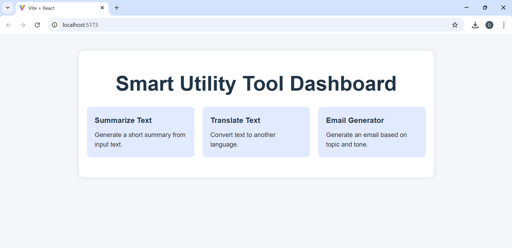
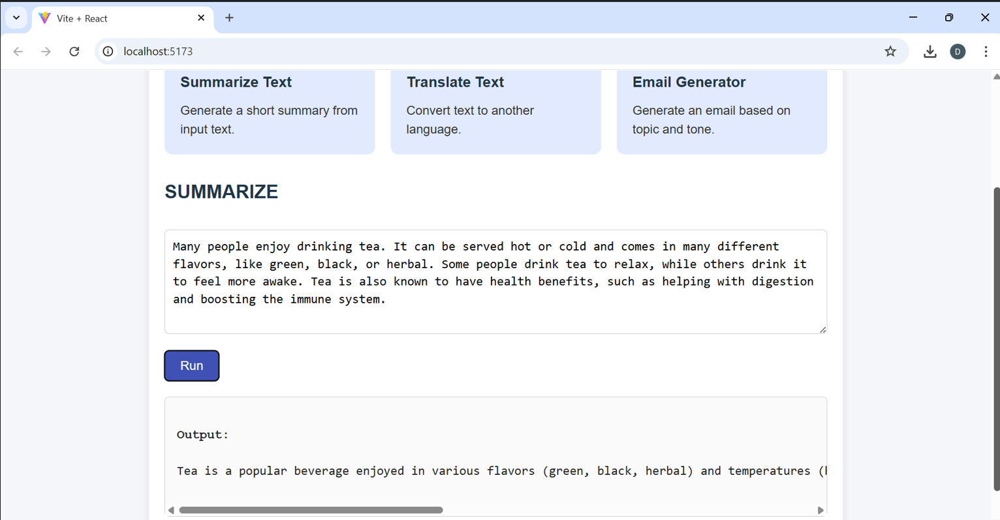
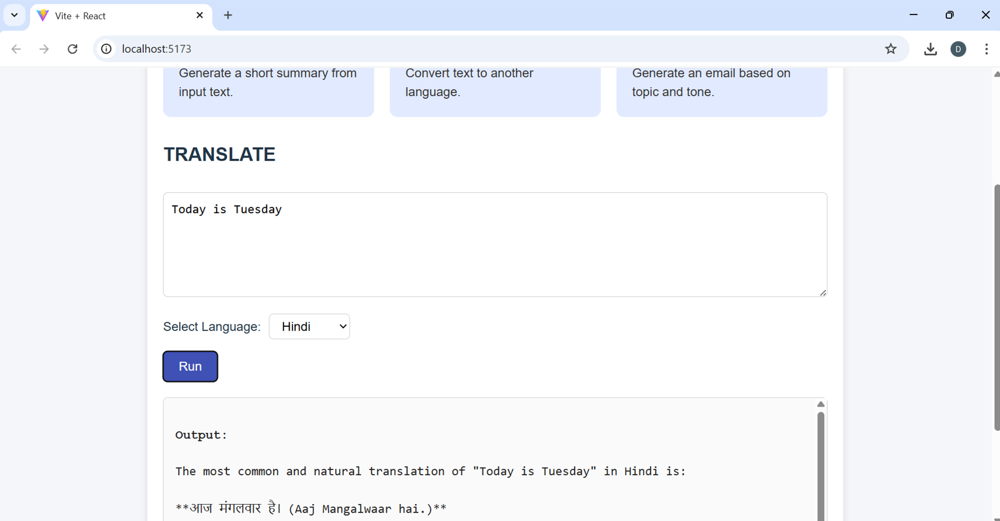
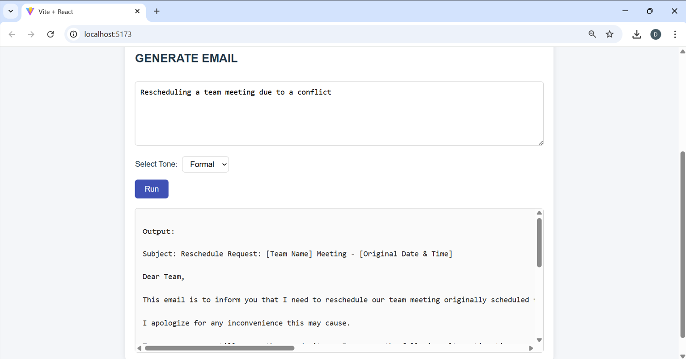

# 🧠 Smart Utility Tool Dashboard

A simple full-stack utility dashboard that provides three useful text tools:

- ✂️ **Summarize Text**
- 🌍 **Translate Text** (e.g., Hindi, French, Spanish)
- ✉️ **Generate Emails** (with formal or casual tone)

Built using **React.js + Node.js + Express.js** and integrated with **Gemini AI** for powerful content generation.

---

## 📸 Demo

 



---

## ⚙️ Features

- 🎯 **Summarization**: Quickly condense long text using Gemini AI.
- 🌐 **Translation**: Translate text into multiple languages (Hindi, French, Spanish, etc.).
- ✍️ **Email Generator**: Generate professional or casual emails from a topic.

---

## 🚀 Tech Stack

### Frontend
- React + Vite
- Axios for HTTP requests
- Responsive design with CSS

### Backend
- Node.js + Express.js
- Google Gemini API (via `@google/generative-ai`)

---

## 📁 Project Structure

```
utility-tool/
├── backend/
│   ├── index.js          # Express server
│   ├── routes/           # Summarize, translate, email routes
│   ├── test-gemini.js    # Gemini test script
│   └── .env              # API Key for Gemini
├── frontend/
│   ├── App.jsx           # Main React app
│   ├── App.css           # Dashboard styles
│   └── main.jsx          # Entry point
└── README.md
```

---

## 🛠️ Setup Instructions

### 1. Clone the repository

```bash
git clone https://github.com/dishachandaria/smart-utility-tool.git
cd smart-utility-tool
```

### 2. Backend Setup

```bash
cd backend
npm install
```

- Create a `.env` file:

```
GEMINI_API_KEY=your_api_key_here
```

- Start the backend:

```bash
node index.js
```

### 3. Frontend Setup

```bash
cd ../frontend
npm install
npm run dev
```

Visit `http://localhost:5173` in your browser.

---

